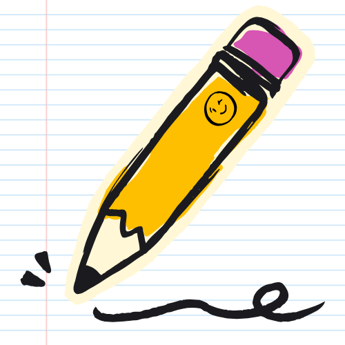

<h1 align='center'>Noted 📓 
Live Site: https://noted-notebook.netlify.app/
</h1>

# Description

Noted is a Notion-style online editor that allows users to create, edit, and organize rich content pages. It's powered by <strong>Supabase</strong> as the backend (for auth, storage, and database), and built with <strong>React.js</strong>, <strong>TypeScript</strong>, and <strong>Vite</strong> on the frontend, deployed on <strong>Netlify</strong>. Users can sign in passwordlessly, edit blocks, reorder content via drag-and-drop, and customize pages with emojis, cover images, and resizable images w/ captions. The app includes comprehensive unit and integration testing with over <strong>95% line coverage</strong> using <strong>Vitest</strong> and <strong>React Testing Library</strong>

<h1>How to Use:</h1>

Enter your email address to sign in passwordlessly

 

Check your email inbox for an email from <strong>Supabase Auth</strong> titled <strong>Join Noted 📓</strong>

 

Follow the instructions on the home page to learn how the app works

Add different content blocks (nodes), including:

<ul>
    <li>Text blocks</li>
    <li>Headings (H1-H3)</li>
    <li>Ordered and unordered lists</li>
    <li>Images with captions</li>
    <li>Links to other pages</li>
</ul>

Rearrange content with drag and drop by dragging any block to reposition it within the page using smooth, intuitive drag-and-drop interactions

Customize page visuals:

<ul>
    <li>Add a cover image to any page</li>
    <li>Reposition the cover image vertically</li>
    <li>Resize images on desktop and laptop screens</li>
    <li>Change the page's emoji</li>
</ul>

Navigate between pages by linking to other pages within Noted to create a connected workspace

## Features
<li>Passwordless authentication using Supabase's magic link auth system
</li>
 

<li>Pages consist of draggable content "nodes" using @dnd-kit
</li>
 

<li>Multiple node types accessible by typing '/' to bring up the command panel + search for node type or use arrow keys to move between the options
</li>
 

<li>Supports image + caption uploads by using Supabase's S3 buckets
</li>
 

<li>Row-Level Security (RLS) on Supabase DB
</li>
 

<li>Unit + integration tests with 95%+ line coverage
</li>
 

<li>Persistant storage using Supabase for the DB and S3 image bucket
</li>
 

<li>Image resizing on desktop + laptop screens using re-resizable
</li>
 

<li>Cover images on each page with vertical repositioning
</li>
 

<li>Pick an emoji for each page using emoji-picker
</li>
 

<li>Easily delete pages that you no longer need
</li>
 

<li>Replace or delete images with buttons visible on hover
</li>
 

<li>Tokens removed during sign-out, so re-authentication is required
</li>
 

<li>Responsive layout using Flexbox
</li>
 

<li>Form Validation & Error Messages
</li>
 

<li>Custom site favicon
</li>
 

<li>Mobile-friendly
</li>
 

<h3>Technical challenges I overcame:</h3>
<li>Designing a Notion-style block architecture where each node type has its own rendering, state, and drag behaviour</li>
<li>Persisting complex editor state (node order, content, image metadata, captions, and resize/repositioning dimensions) in Supabase</li>
<li>Building repositionable cover images while preventing layout breakage or white space overflow</li>
<li>Writing extensive unit and integration tests for a highly interactive UI, achieving over 95% line coverage</li>
<li>Mocking external dependencies (Supabase, drag events, image repositioning, emoji picker) for reliable tests</li>
<li>Ensuring keyboard usability in an interactive editor environment</li>

<h3>Possible Future Improvements:</h3>
<li>Unsplash API integration to allow users to choose from stock photos for cover images</li>
<li>Page descriptions and/or tags</li>
<li>Rich text formatting (bold, italic, inline code, etc)</li>
<li>Collaborative real-time editing</li>
<li>Version history and undo/redo support</li>
<li>Public page sharing + read-only views</li>
<li>Import/export pages</li>
<li>Dark mode</li>

  
